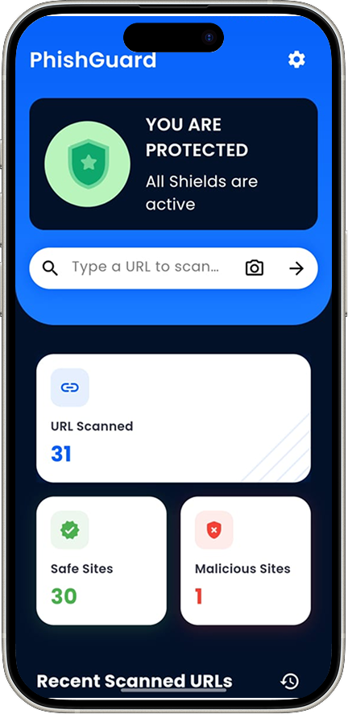
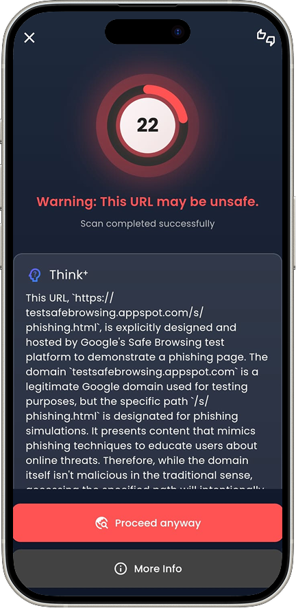
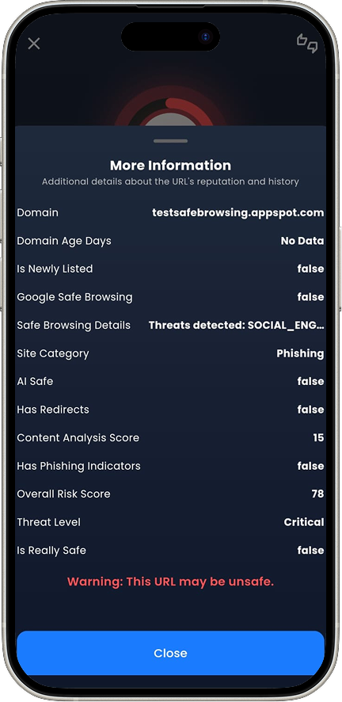

# 🛡️ PhishGuard

**AI-powered phishing detection app** built with Flutter to scan and secure links clicked across the device—automatically and in real time.

---

## 🚀 Features

- 🔍 **Real-Time URL Scanning**  
  Detects phishing links with over **92% accuracy** using AI-powered REST APIs.

- 🌐 **Click-to-Scan From Any App**  
  Automatically scans links clicked **anywhere on the device** (browser, SMS, chat apps) **even if PhishGuard is not open**.

- 🧠 **AI-Powered Risk Score (0–100)**  
  Instantly assigns a threat level to every URL so users can make informed decisions.

- 🛡️ **In-App Secure Browser**  
  Opens verified URLs in a **sandboxed** browser to prevent redirection exploits.

- 🚨 **One-Tap Phishing Reports**  
  Community-driven reporting system to flag suspicious links and improve safety for all users.

- ⚡ **Fast Performance**  
  URL scan time reduced from **5s to 2.3s**, ensuring a smooth experience.

- 🔒 **Security First**  
  SSL pinning, sandboxed link execution, and secure API communication.

---

## 🆚 Compared to Airtel Safe Internet

| Feature                            | Airtel Safe Internet      | PhishGuard                          |
|------------------------------------|----------------------------|-------------------------------------|
| Platform Dependency                | Only for Airtel users      | Works on **any network/device**     |
| Device-wide Link Detection         | ✅                          | ✅                                   |
| AI Risk Scoring (0–100)            | ❌                          | ✅                                   |
| In-App Secure Browser              | ❌                          | ✅                                   |
| One-Tap Community Reporting        | ❌                          | ✅                                   |
| Works Offline / Custom APIs        | ❌                          | ✅                                   |
| Open Source / Developer Access     | ❌                          | ✅ *(GitHub Repository)*            |

> ⚡ **PhishGuard** brings carrier-independent, developer-first, AI-enhanced security to all users, regardless of SIM or service provider.

---

## 💰 Funding & Support Needed

While PhishGuard is already functional and proven, **additional funding is essential** for:

- Enhancing AI model accuracy and threat detection
- Expanding and maintaining a dynamic phishing URL dataset
- Scaling API infrastructure for high-volume usage
- Publishing on **Google Play Store** and **Apple App Store**
- Covering developer program fees, compliance costs, and store listing optimization
- Marketing to reach our target of 10,000+ active users in the first phase

> 💡 If you’re an investor, university, or organization interested in digital safety, **we’d love to collaborate and scale PhishGuard to production**.

---

## 📱 Screenshots

| Home Screen | Scan Result | Report Phishing |
|-------------|-------------|-----------------|
|  |  |  |

---

## 🛠️ Tech Stack

- **Flutter & Dart** – UI development
- **Node.js + Express.js** – Backend REST APIs
- **MongoDB Atlas** – Threat database
- **Google Safe Browsing API** – URL threat evaluation
- **Platform-specific Intents/Listeners** – For intercepting link clicks across the device

---

## 🔐 Security Measures

- SSL Pinning  
- Sandboxed URL Execution  
- Token-based API Access  
- Input Validation and URL Encoding

---

## 📦 Installation

```bash
git clone https://github.com/am-saksham/PhishGuard.git
cd phish-guard
flutter pub get
flutter run
